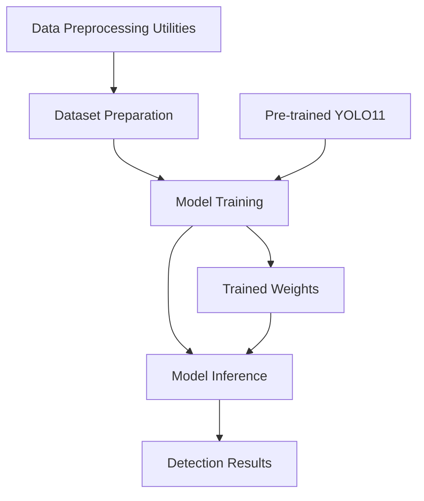
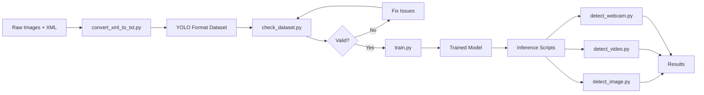
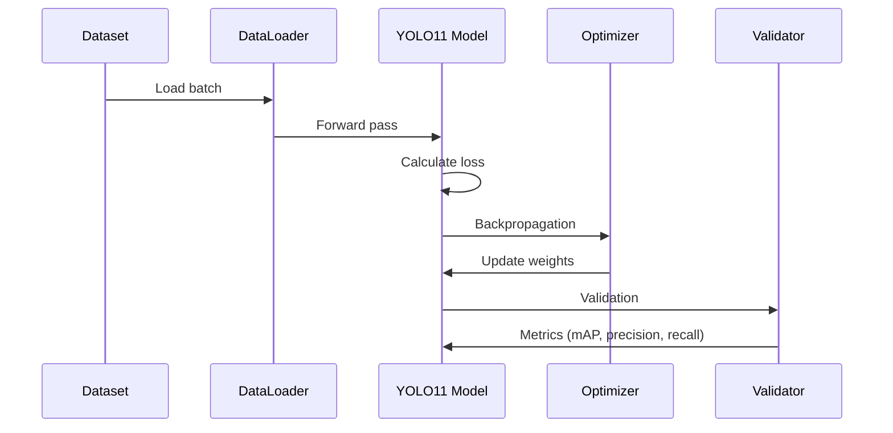

# System Architecture

This document provides a technical overview of the License Plate Detector system architecture, components, and data flow.

## 🏗️ Architecture Overview

The system follows a modular architecture with three main components:



## 📦 Core Components

### 1. Data Preprocessing Module

**Purpose**: Convert, validate, and prepare datasets for YOLO training

**Key Scripts**:
- `convert_xml_to_txt.py` - XML to YOLO format converter
- `check_dataset.py` - Dataset integrity validator
- `create_empty_labels.py` - Empty label file generator
- `rename_img_labels.py` - Batch file renamer

**Data Flow**:
```
Raw Annotations (XML) → convert_xml_to_txt.py → YOLO Format (.txt)
                                                        ↓
                                                check_dataset.py
                                                        ↓
                                                 Validated Dataset
```

### 2. Training Module

**Purpose**: Train and fine-tune YOLO11 models on custom license plate datasets

**Location**: `training/`

**Key Components**:
- **train.py**: Initial training script
  - Loads pre-trained YOLO11n (nano) model
  - Configures training hyperparameters
  - Saves checkpoints and best weights
  
- **resume_train.py**: Resume interrupted training
  - Loads last checkpoint
  - Continues from previous epoch

**Training Pipeline**:
```
Pre-trained YOLO11n → Load Dataset → Training Loop → Validation → Save Weights
        ↓                                    ↓
   yolo11n.pt                         runs/*/weights/
                                      ├── best.pt
                                      └── last.pt
```

**Training Configuration**:
```python
{
    "model": "yolo11n.pt",      # Nano variant (fastest)
    "epochs": 100,
    "image_size": 640,
    "batch_size": 16,
    "device": 0,                # GPU
    "optimizer": "auto",        # Automatic optimizer selection
    "augmentation": "auto"      # Automatic augmentation
}
```

### 3. Inference Module

**Purpose**: Detect license plates in various input sources

**Location**: `inference/`

**Scripts**:

| Script | Input | Output | Use Case |
|--------|-------|--------|----------|
| `detect_image.py` | Single image | Displayed result | Testing, single image processing |
| `detect_video.py` | Video file | Saved video with detections | Batch video processing |
| `detect_webcam.py` | Webcam stream | Real-time display | Live monitoring, simple demos |
| **`run_model.py`** | Webcam stream | Real-time display + UI | **Production webcam detection with controls** |

**Inference Pipeline**:
```
Input Source → Load Model → Preprocessing → Detection → Post-processing → Output
                   ↓
              best.pt
```

**Detection Process**:
1. **Input Loading**: Read image/video/webcam frame
2. **Preprocessing**: Resize to 640×640, normalize
3. **Model Forward Pass**: YOLO11 backbone + detection head
4. **Post-processing**: Non-max suppression (NMS), confidence filtering
5. **Output**: Bounding boxes with class labels and confidence scores

## 🧠 Model Architecture

### YOLO11 Nano (yolo11n.pt)

**Architecture Characteristics**:
- **Type**: Single-shot object detector
- **Backbone**: CSPDarknet (lightweight variant)
- **Neck**: PANet (Path Aggregation Network)
- **Head**: YOLO detection head
- **Input Size**: 640×640 pixels
- **Output**: Bounding boxes [x, y, w, h] + class probabilities

**Model Variants**:
- **yolo11n** (nano): Fastest, lowest accuracy (~2.6M parameters)
- **yolo11s** (small): Balanced speed/accuracy
- **yolo11m** (medium): Higher accuracy
- **yolo11l** (large): High accuracy, slower
- **yolo11x** (extra-large): Best accuracy, slowest

Current implementation uses **yolo11n** for speed optimization.

### Custom Training Adaptations

The model is fine-tuned for:
- Single class detection: "Kataho_Plate"
- Input images: License plate images (various sizes)
- Transfer learning: Pre-trained on COCO → Fine-tuned on custom dataset

## 📊 Data Format

### YOLO Label Format

Each image has a corresponding `.txt` file with annotations:

```
<class_id> <x_center> <y_center> <width> <height>
```

**Example**:
```
0 0.512 0.347 0.284 0.156
```

- All values normalized to [0, 1]
- `x_center`, `y_center`: Center of bounding box
- `width`, `height`: Box dimensions
- `class_id`: 0 for "Kataho_Plate"

### Dataset Configuration (data.yaml)

```yaml
path: /absolute/path/to/dataset       # Dataset root
train: /path/to/dataset/images/train  # Training images
val: /path/to/dataset/images/val      # Validation images
test: /path/to/dataset/images/val     # Test images (same as val)

nc: 1                                 # Number of classes
names:
  - Kataho_Plate                      # Class name
```

## 🔄 Data Flow Diagram

### Complete System Flow



### Training Data Flow



## 🗂️ Directory Structure Explained

```
Plate-Detector/
├── dataset/                    # Training data
│   ├── data.yaml              # Dataset config (paths, classes)
│   ├── images/
│   │   ├── train/            # Training images (~70-80%)
│   │   └── val/              # Validation images (~20-30%)
│   └── labels/
│       ├── train/            # YOLO format labels
│       └── val/              # Validation labels
│
├── training/                   # Training scripts
│   ├── train.py              # Initial training
│   ├── resume_train.py       # Resume from checkpoint
│   └── runs/                 # Training outputs
│       └── plate_detector_yolo11/
│           ├── weights/      # Model checkpoints
│           │   ├── best.pt   # Best validation mAP
│           │   └── last.pt   # Last epoch
│           ├── results.png   # Training curves
│           └── confusion_matrix.png
│
├── inference/                  # Inference scripts
│   ├── detect_image.py       # Single image detection
│   ├── detect_video.py       # Video processing
│   └── detect_webcam.py      # Basic real-time detection
│
├── Helper_Files/               # Data preprocessing utilities
│   ├── check_dataset.py      # Validate labels
│   ├── convert_xml_to_txt.py # XML → YOLO conversion
│   ├── create_empty_labels.py # Generate empty labels
│   └── rename_img_labels.py  # Rename files
│
└── run_model.py                # Advanced webcam detection with UI
```

## 🔧 Key Dependencies

| Dependency | Purpose | Version |
|------------|---------|---------|
| `ultralytics` | YOLOv11 framework | Latest |
| `torch` | Deep learning backend | ≥1.8.0 |
| `torchvision` | Image transformations | Compatible |
| `opencv-python` | Image/video processing | Latest |
| `numpy` | Numerical operations | Latest |

### Dependency Roles

- **ultralytics**: Provides YOLO11 model architecture, training loop, and inference
- **PyTorch**: Neural network backend, GPU acceleration
- **OpenCV**: Image I/O, video processing, webcam access
- **NumPy**: Array operations, coordinate transformations

## ⚡ Performance Considerations

### Training Performance

- **GPU Utilization**: ~70-90% on single GPU
- **Training Speed**: ~100 images/sec (depends on GPU)
- **Memory Usage**: ~4-6 GB VRAM (batch=16, yolo11n)

### Inference Performance

| Input Type | FPS | Latency | Device |
|------------|-----|---------|--------|
| Image | N/A | ~20ms | GPU |
| Video | ~45-60 | ~16-22ms | GPU |
| Webcam | ~30-45 | ~22-33ms | GPU |

*Performance measured on NVIDIA RTX series GPU*

## 🔐 Model Persistence

**Training Outputs**:
```
runs/plate_detector_yolo11/
├── weights/
│   ├── best.pt              # Best model (lowest validation loss)
│   └── last.pt              # Last training epoch
├── results.csv              # Epoch-wise metrics
├── results.png              # Training/validation curves
├── confusion_matrix.png     # Classification matrix
└── args.yaml                # Training arguments
```

**Recommended for Inference**: Use `best.pt` for optimal detection accuracy.

## 🚀 Optimization Opportunities

### Current Architecture
- Model: YOLO11n (nano) - optimized for speed
- Batch size: 16 - balanced memory/speed
- Input size: 640×640 - standard YOLO resolution

### Potential Improvements
1. **Accuracy**: Upgrade to `yolo11s` or `yolo11m` for better detection
2. **Speed**: Reduce input size to 416×416 for faster inference
3. **Scalability**: Implement batch inference for video processing
4. **Deployment**: Export to ONNX/TensorRT for production

---

For implementation details, see [USAGE_GUIDE.md](USAGE_GUIDE.md) and [API_REFERENCE.md](API_REFERENCE.md).
